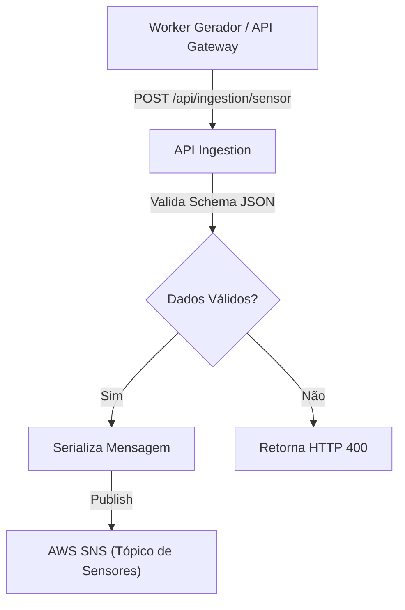

# 🚀 Agrosolutions Service Ingestion
[](https://dotnet.microsoft.com/download/dotnet/10.0)
[](https://aws.amazon.com/sns/)
[](https://aws.amazon.com/eks/)

`agrosolutions-service-ingestion` é uma API Raw de alta performance responsável pela ingestão, validação e publicação de dados de sensores agrícolas para processamento posterior.

# 🎯 Objetivos

 - Receber cargas de dados (payloads) de sensores via HTTP.
 - Garantir desacoplamento e alta disponibilidade utilizando a infraestrutura da AWS (SNS).
 - Fornecer endpoints de health check para monitorização da infraestrutura.

# 📃 Funcionalidades principais:

 - **Ingestão de Dados**: Endpoint único (`POST /api/ingestion/sensor`) capaz de processar dados polimórficos.
 - **Validação Polimórfica**: Utiliza FluentValidation para aplicar regras específicas dependendo do `TypeSensor` (ex: valida pH para sensores de solo, CO₂ para silos).
 - **Publicação**: Encaminha mensagens válidas para um Tópico do **AWS SNS**, permitindo que múltiplos serviços consumidores assinem e processem estes dados no futuro.
 - **Monitorização**: Rota de `/health` para verificação de disponibilidade pelo Kubernetes.

# 🔍 Validação e Dados

A API não persiste dados diretamente numa base de dados relacional, focando-se no throughput. Ela valida a integridade da mensagem antes da publicação.

A API expõe o seguinte endpoint principal:

 - **Ingestão (`POST /api/ingestion/sensor`)**:
     - Recebe um JSON contendo `FieldId`, `SensorId`, `TypeSensor`, `TimeStamp` e um objeto `Data` dinâmico.
     - Retorna `202 Accepted` se o JSON for válido e publicado no tópico SNS com sucesso.
     - Retorna `400 Bad Request` com detalhes do erro se o schema do objeto `Data` não corresponder ao tipo de sensor.

# ⚙️ Dependências

O projeto utiliza as seguintes bibliotecas principais:

 - Microsoft.AspNetCore.OpenApi
 - FluentValidation.AspNetCore (Validação robusta)
 - **AWSSDK.SNS** (Publicação de Mensagens na AWS)
 - **AWSSDK.SecurityToken** (Autenticação IRSA no EKS)
 - Swashbuckle.AspNetCore (Swagger)

# 🔄️ Fluxo de Ingestão



# 🏗️ Arquitetura e Deployment

## Estrutura do Projeto

```text
agrosolutions-service-ingestion/
├── src/
│   ├── Api/                    # Controllers, Program.cs
│   ├── Application/            # Use Cases, Validators
│   ├── Infrastructure/         # Messaging (AWS SNS)
│   └── Shared/                 # DTOs, Enums
├── k8s/production/             # Kubernetes manifests
│   ├── namespace.yaml
│   ├── deployment.yaml         # 2-10 replicas autoscaling
│   ├── services.yaml
│   ├── ingress-aws.yaml        # Regras de roteamento externo
│   ├── hpa.yaml                # Horizontal Pod Autoscaler
│   ├── observability.yaml      # Prometheus metrics & alerts
│   └── resource-configs.yaml   # NetworkPolicy, PDB, Quotas
├── .github/workflows/
│   └── deploy.yml              # CI/CD pipeline
└── Dockerfile                  # Multi-stage .NET 10 Alpine

```

## Deployment em Produção (AWS EKS)

### 🚀 CI/CD Automático

Push para a branch `main` dispara automaticamente:

1. ✅ Build e testes
2. ✅ Build da imagem Docker
3. ✅ Push para ECR (`316295889438.dkr.ecr.sa-east-1.amazonaws.com/agrosolutions-ingestion-api`)
4. ✅ Deploy no cluster EKS
5. ✅ Aguarda rollout e verifica saúde

Ver: [k8s/CI_CD_SUMMARY.md](https://www.google.com/search?q=k8s/CI_CD_SUMMARY.md)

### 📊 Recursos Kubernetes

* **Namespace**: `agrosolutions-ingestion`
* **Replicas**: 2 mínimo, 10 máximo (autoscaling por CPU/Memória)
* **Port**: Container `8080`, Service `80`
* **Resources**: 256Mi-512Mi RAM, 200m-1000m CPU
* **Probes**: Liveness e Readiness em `/health`
* **Permissões (IRSA)**: Utiliza a IAM Role `agrosolutions-ingestion-role` mapeada no ServiceAccount para aceder ao AWS SNS com segurança.
* **Observability**: Prometheus ServiceMonitor + Alertas

### 🔐 Secrets Necessárias

Configurar no GitHub (`Settings > Secrets`):

* `AWS_ACCESS_KEY_ID`
* `AWS_SECRET_ACCESS_KEY`

Ver: [.github/SECRETS_SETUP.md](https://www.google.com/search?q=.github/SECRETS_SETUP.md)

## Deploy Manual

```bash
# 1. Configurar kubectl
aws eks update-kubeconfig --name agrosolutions-eks-cluster --region sa-east-1

# 2. Aplicar manifestos
kubectl apply -f k8s/production/

# 3. Verificar deployment
kubectl get pods -n agrosolutions-ingestion
kubectl logs -n agrosolutions-ingestion -l app=ingestion-api --tail=50 -f

```

Ver documentação completa: [k8s/README.md](https://www.google.com/search?q=k8s/README.md)

# 💻 Desenvolvimento Local

## Requisitos

* .NET SDK 10.0
* Docker e Docker Compose
* AWS CLI (configurado com credenciais)

## Executar Localmente

```bash
# Opção 1: Diretamente com .NET
dotnet run --project src/AgrosolutionsServiceIngestion.Api/AgrosolutionsServiceIngestion.Api.csproj

# Opção 2: Via Docker Compose
docker-compose up -d

# Aceder: http://localhost:5198/swagger
# Health: http://localhost:5198/health

```

