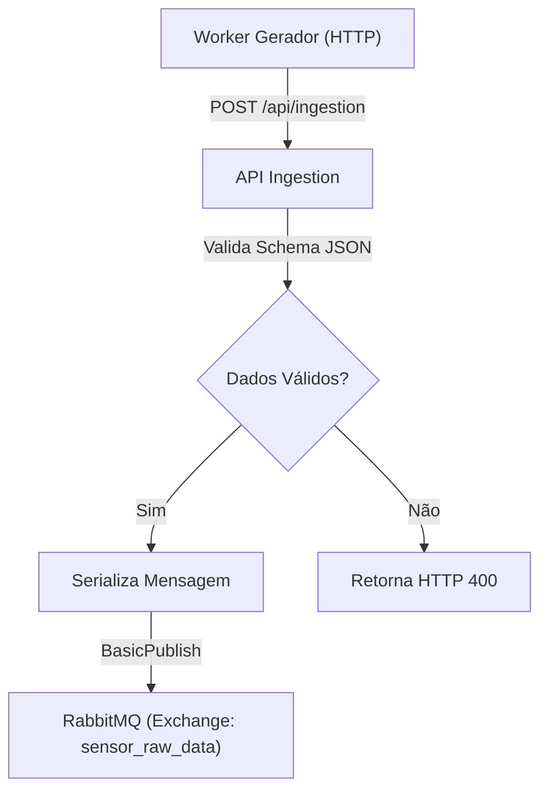

# 🚀 Agrosolutions Service Ingestion

`agrosolutions-service-ingestion` é uma API Raw de alta performance responsável pela ingestão, validação e enfileiramento de dados de sensores agrícolas para processamento posterior.

# 🎯 Objetivos

 - Receber cargas de dados (payloads) de sensores via HTTP.
 - Garantir desacoplamento e alta disponibilidade utilizando RabbitMQ.
 - Fornecer endpoints de health check para monitoramento de infraestrutura.

# 📃 Funcionalidades principais:

 - **Ingestão de Dados**: Endpoint único (`POST /api/ingestion`) capaz de processar dados polimórficos.
 - **Validação Polimórfica**: Utiliza FluentValidation para aplicar regras específicas dependendo do `type_sensor` (ex: valida pH para sensores de solo, CO₂ para silos).
 - **Publicação Fanout**: Encaminha mensagens válidas para uma Exchange Fanout no RabbitMQ (`sensor_raw_data`), permitindo múltiplos consumidores futuros.
 - **Monitoramento**: Rota de `/health` para verificação de disponibilidade.

# 🔍 Validação e Dados

A API não persiste dados diretamente no banco relacional, focando em throughput. Ela valida a integridade da mensagem antes do enfileiramento.

A API expõe o seguinte endpoint principal:

 - **Ingestão (`POST /api/ingestion`)**:
     - Recebe um JSON contendo `FieldId`, `SensorId`, `TypeSensor`,`TimeStamp` e um objeto `Data` dinâmico.
     - Retorna `202 Accepted` se o JSON for válido e enfileirado com sucesso.
     - Retorna `400 Bad Request` com detalhes do erro se o schema do objeto `data` não corresponder ao tipo de sensor.

# ⚙️ Dependências

O projeto utiliza as seguintes bibliotecas principais:

 - Microsoft.AspNetCore.OpenApi
 - FluentValidation.AspNetCore (Validação robusta)
 - RabbitMQ.Client (Mensageria)
 - Swashbuckle.AspNetCore (Swagger)

# 🔄️ Fluxo de Ingestão

